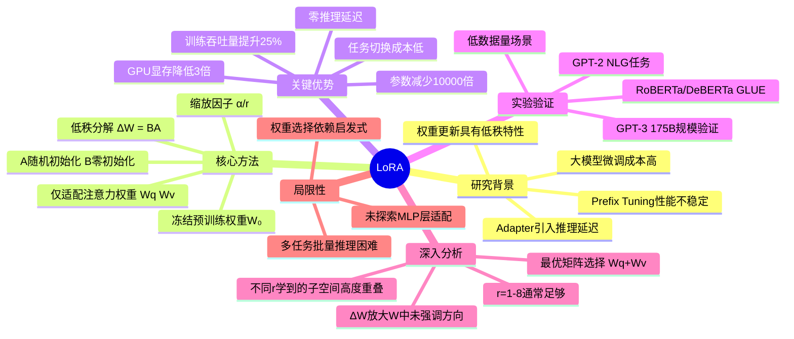

# LoRA: Low-Rank Adaptation of Large Language Models

## 基本信息
- **标题**: LoRA: Low-Rank Adaptation of Large Language Models
- **作者**: Edward Hu, Yelong Shen, Phillip Wallis, Zeyuan Allen-Zhu, Yuanzhi Li, Shean Wang, Lu Wang, Weizhu Chen
- **机构**: Microsoft Corporation
- **发表时间**: 2021年6月 (arXiv:2106.09685, Version 2)
- **论文链接**: 本地PDF

## 一、研究背景与动机

大规模预训练语言模型（如 GPT-3 175B）在下游任务上的全量微调面临两个核心挑战：

1. **存储与部署成本极高**：每个下游任务都需要存储一份完整的模型副本（175B 参数），部署 100 个任务需要 35TB 存储空间，这在实际生产环境中不可行。
2. **硬件门槛高**：全量微调需要与预训练相当的显存（GPT-3 175B 需 1.2TB VRAM），且需要为 Adam 优化器维护动量和方差状态。

现有高效适配方法存在局限：
- **Adapter**：在 Transformer 层间插入适配器模块，虽然参数量少，但引入了额外的推理延迟（batch size=1 时延迟增加高达 30%），因为适配器层必须顺序计算。
- **Prefix Tuning**：优化输入层的连续 prompt，但性能随可训练参数非单调变化，且占用了可用的序列长度。

**核心洞察**：受 Li et al. (2018a) 和 Aghajanyan et al. (2020) 的启发——过度参数化的模型实际上驻留在低维本征维度上——作者假设模型适配过程中的**权重变化量也具有低"本征秩"**。

## 二、核心贡献

1. **提出 LoRA（Low-Rank Adaptation）方法**：冻结预训练权重，通过可训练的低秩分解矩阵来间接训练密集层，大幅减少可训练参数数量。
2. **零额外推理延迟**：LoRA 模块可以与原始权重合并，部署时无额外计算开销，这是相比 Adapter 的关键优势。
3. **极致的参数效率**：在 GPT-3 175B 上，可训练参数减少 10,000 倍（从 175B 到 4.7M），GPU 显存需求降低 3 倍（从 1.2TB 到 350GB）。
4. **全面的实证分析**：深入研究了低秩更新的性质，包括不同权重矩阵的适配效果、最优秩 r 的选择、以及 ΔW 与 W 的关系。
5. **性能持平或超越全量微调**：在 RoBERTa、DeBERTa、GPT-2 和 GPT-3 上均表现出与全量微调相当甚至更优的性能。

## 三、方法详解

### 3.1 低秩参数化更新矩阵

对于预训练权重矩阵 W₀ ∈ ℝ^(d×k)，LoRA 将其更新约束为低秩分解形式：

$$h = W_0 x + \Delta W x = W_0 x + BAx$$

其中：
- B ∈ ℝ^(d×r)，A ∈ ℝ^(r×k)，秩 r ≪ min(d, k)
- **W₀ 被冻结**，不接收梯度更新
- A 和 B 包含可训练参数
- A 使用随机高斯初始化，**B 初始化为零**，确保训练开始时 ΔW = BA = 0
- ΔWx 按 α/r 缩放，α 为常数超参数

**缩放因子 α/r 的作用**：当使用 Adam 优化时，调整 α 大致等价于调整学习率。设置 α 为首次尝试的 r 值即可，不需要额外调参，这减少了改变 r 时重新调参的需要。

### 3.2 优化目标（公式 2 详解）

LoRA 的优化目标是对全量微调（公式 1）的参数高效改造：

$$\max_{\Theta} \sum_{(x,y) \in Z} \sum_{t=1}^{|y|} \log p_{\Phi_0 + \Delta \Phi(\Theta)}(y_t | x, y_{<t})$$

逐层拆解：

**外层 `max_Θ`**：全量微调直接优化 Φ（所有模型参数），而 LoRA 改为优化 Θ，一个远小于 Φ₀ 的参数集（|Θ| ≪ |Φ₀|）。

**内层：条件对数似然**：

$$\sum_{(x,y) \in Z} \sum_{t=1}^{|y|} \log p(y_t | x, y_{<t})$$

这是标准的自回归语言建模目标——给定输入上下文 x 和之前已生成的 token y_{<t}，最大化正确生成下一个 token y_t 的对数概率。

**关键区别：`Φ₀ + ΔΦ(Θ)`**：

| 符号 | 含义 | 公式 1（全量微调） | 公式 2（LoRA） |
|------|------|------------------|---------------|
| Φ₀ | 预训练权重 | 初始化，可变 | **冻结，不变** |
| ΔΦ | 权重增量 | 直接优化，\|ΔΦ\| = \|Φ₀\| | **通过 Θ 编码**，\|ΔΦ(Θ)\| ≪ \|Φ₀\| |

全量微调中，ΔΦ 就是梯度更新后的完整参数，维度与 Φ₀ 完全相同。而 LoRA 中，ΔΦ 被**重新参数化**为一个小参数集 Θ 的函数：ΔΦ(Θ) = BA，其中 B ∈ ℝ^(d×r)，A ∈ ℝ^(r×k)，r ≪ d,k。实际训练的参数量从 d×k 降到了 d×r + r×k。

**直觉理解**：公式 2 说的是——找到一组极小的参数 Θ，使得在预训练权重 Φ₀ 的基础上加上由 Θ 产生的微小调整 ΔΦ(Θ) 后，模型在下游任务上表现最好。以 GPT-3 175B 为例，Θ 仅为 4.7M 参数（Φ₀ 的 **0.0027%**），就能达到甚至超越全量微调 175B 参数的效果。

### 3.2 应用于 Transformer

- 在自注意力模块中，有四个权重矩阵 W_q, W_k, W_v, W_o 和 MLP 模块中的两个
- LoRA **仅适配注意力权重**（主要是 W_q 和 W_v），冻结 MLP 模块
- 可训练参数数量：|Θ| = 2 × L̂_LoRA × d_model × r

### 3.3 关键设计优势

1. **模型共享**：一个预训练模型可服务多个任务，只需切换 LoRA 矩阵 A 和 B
2. **训练高效**：不需要为冻结参数计算梯度和维护优化器状态，GPT-3 175B 训练吞吐量提升 25%
3. **零推理延迟**：部署时显式计算 W = W₀ + BA，推理与全量微调模型完全一致
4. **任务切换成本低**：通过减去 BA 再加上不同的 B'A' 即可快速切换任务

### 3.4 可训练参数量对比

| 模型 | 全量微调 | LoRA (r=1, Wq+Wv) | 减少倍数 |
|------|---------|-------------------|---------|
| GPT-3 175B | 175,255.8M | 4.7M | ~37,000× |
| GPT-3 175B | 175,255.8M | 37.7M (r=8) | ~4,600× |
| DeBERTa XXL | 1,500M | 4.7M | ~319× |

## 四、实验设计与结果

### 4.1 实验设置
- **评估模型**：RoBERTa base/large、DeBERTa XXL、GPT-2 medium/large、GPT-3 175B
- **任务覆盖**：NLU（GLUE benchmark）、NLG（E2E NLG、WebNLG、DART）、SQL 生成（WikiSQL）、对话摘要（SAMSum）
- **硬件**：NVIDIA Tesla V100
- **基线方法**：Full Fine-Tuning、BitFit、Adapter [H/L/P/D]、Prefix-Embedding/Layer Tuning

### 4.2 主要结果

**GLUE Benchmark（NLU）**：
- RoBERTa base：LoRA (0.3M) 平均分 87.2，vs 全量微调 (125M) 的 86.4
- RoBERTa large：LoRA (0.8M) 平均分 89.0，vs 全量微调 (355M) 的 88.9
- DeBERTa XXL：LoRA (4.7M) 平均分 91.3，vs 全量微调 (1,500M) 的 91.1

**E2E NLG Challenge（NLG）**：
- GPT-2 medium：LoRA (0.35M) BLEU 70.4，vs 全量微调 (355M) 的 68.2
- GPT-2 large：LoRA (0.77M) BLEU 70.4，vs 全量微调 (774M) 的 68.5

**GPT-3 175B**：

| 方法 | 可训练参数 | WikiSQL Acc. | MNLI-m Acc. | SAMSum R1/R2/RL |
|------|-----------|-------------|-------------|----------------|
| Full Fine-Tune | 175B | 73.8 | 89.5 | 52.0/28.0/44.5 |
| Adapter [H] | 7.1M | 71.9 | 89.8 | 53.0/28.9/44.8 |
| **LoRA** | **4.7M** | **73.4** | **91.7** | **53.8/29.8/45.9** |
| LoRA | 37.7M | **74.0** | 91.6 | 53.4/29.2/45.1 |

### 4.3 低数据量实验（GPT-3 MNLI-n）

| 方法 | MNLI-100 | MNLI-1k | MNLI-10k | MNLI-Full |
|------|----------|---------|----------|-----------|
| Fine-Tune | 60.2 | **85.8** | 88.9 | 89.5 |
| PrefixEmbed | 37.6 | 75.2 | 79.5 | 88.6 |
| PrefixLayer | 48.3 | 82.5 | 85.9 | 89.6 |
| **LoRA** | **63.8** | 85.6 | **89.2** | **91.7** |

LoRA 在低数据场景下表现尤为出色。

## 五、关键创新点

### 5.1 方法论创新
- **低秩更新假设的实证验证**：首次系统性地证明模型适配中权重更新矩阵确实具有低秩特性，r=1 甚至 r=2 就能取得优秀效果。
- **权重合并设计**：通过将 BA 加到 W₀ 上实现零推理延迟，这是与 Adapter 方法的关键区别。

### 5.2 对低秩更新的深入洞察
- **子空间相似性分析**：不同 r 值学到的子空间高度重叠（尤其是 top 奇异向量方向），说明增大 r 并不能覆盖更多有意义的子空间。
- **ΔW 与 W 的关系**：
  - ΔW 与 W 相关性比随机矩阵更强，但 ΔW **放大的是 W 中未被强调的方向**（而非重复 W 的 top 奇异方向）
  - 放大因子很大（r=4 时约 21.5 倍），说明 LoRA 的本质是**放大预训练模型中学到但不突出的重要特征**

### 5.3 实践指导
- 适配 W_q 和 W_v 效果最好，比单独适配一个矩阵效果更好
- 秩 r 的选择：r=1 到 r=8 通常足够，性能不会随 r 增大而单调提升
- LoRA 可以与 Prefix Tuning 正交组合，进一步提升性能

## 六、局限性与未来工作

1. **任务批量推理困难**：如果将 A 和 B 合并到 W 中，不同任务的 LoRA 模块无法在同一个 forward pass 中批量处理不同任务的输入。
2. **未探索 MLP 层适配**：仅研究了注意力权重的适配，MLP 层、LayerNorm 层和偏置的适配留待未来工作。
3. **权重选择依赖启发式**：选择哪些权重矩阵应用 LoRA 主要基于实验，缺乏更原则性的方法。
4. **r 的选择**：虽然实验表明小 r 足够，但不同任务的最优 r 可能不同（如跨语言任务可能需要更大 r）。
5. **低秩暗示 W 可能也是低秩的**：ΔW 的低秩特性暗示 W 本身也可能是秩不足的，这为未来工作提供了灵感。

## 七、个人思考

待填写：阅读后的个人思考、启发、与相关工作的联系。

## 脑图结构

> 提示：可将上述 Mermaid 代码粘贴到 [Mermaid Live Editor](https://mermaid.live/) 或支持 Mermaid 的编辑器中查看

## 相关论文

- **QLoRA** (Dettmers et al., 2023): 在 LoRA 基础上引入 4-bit 量化，进一步降低显存需求
- **LongLoRA** (Chen et al., 2023): 将 LoRA 扩展到长上下文场景的高效微调
- **Adapter** (Houlsby et al., 2019): 经典的参数高效微调方法
- **Prefix-Tuning** (Li & Liang, 2021): 通过优化连续 prompt 进行适配
- **Intrinsic Dimensionality** (Aghajanyan et al., 2020): 揭示语言模型微调的低本征维度特性

## 参考文献

- Aghajanyan et al. "Intrinsic Dimensionality Explains the Effectiveness of Language Model Fine-Tuning." arXiv:2012.13255, 2020.
- Brown et al. "Language Models are Few-Shot Learners." arXiv:2005.14165, 2020.
- Houlsby et al. "Parameter-Efficient Transfer Learning for NLP." arXiv:1902.00751, 2019.
- Li & Liang. "Prefix-Tuning: Optimizing Continuous Prompts for Generation." arXiv:2101.00190, 2021.
- Li et al. "Measuring the Intrinsic Dimension of Objective Landscapes." arXiv:1804.08838, 2018.
- Liu et al. "RoBERTa: A Robustly Optimized BERT Pretraining Approach." 2019.
- He et al. "DeBERTa: Decoding-enhanced BERT with Disentangled Attention." 2021.
- Vaswani et al. "Attention is All You Need." NeurIPS, 2017.
