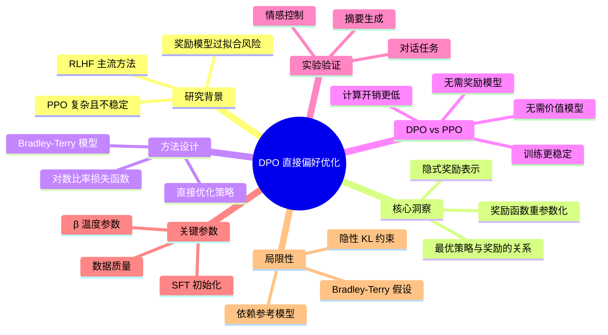

# Direct Preference Optimization: Your Language Model is Secretly a Reward Model

## 基本信息
- **标题**: Direct Preference Optimization: Your Language Model is Secretly a Reward Model
- **作者**: Rafael Rafailov, Joey Hejna, Ryan Dill, Chelsea Finn (Stanford); Scott Emmons, Aviral Kumar, Sergey Levine (UC Berkeley)
- **机构**: Stanford University, UC Berkeley
- **发表时间**: NeurIPS 2023
- **论文链接**: 本地PDF | [arXiv](https://arxiv.org/abs/2305.18290)

## 一、研究背景与动机

### 背景
大语言模型的对齐训练主流方法是 **RLHF（Reinforcement Learning from Human Feedback）**，流程为：
1. **SFT**：有监督微调
2. **RM**：训练奖励模型（从人类偏好数据学习）
3. **PPO**：用强化学习优化策略（最大化奖励，同时约束不偏离太远）

### 动机
传统 RLHF 存在以下问题：
1. **流程复杂** - 需要训练奖励模型，再用 PPO 优化，工程难度高
2. **训练不稳定** - PPO 需要精细调参，容易发散
3. **计算开销大** - 需要同时维护策略模型、奖励模型、参考模型、价值模型
4. **奖励模型过拟合** - 奖励模型可能与真实人类偏好存在偏差

**核心问题**：能否绕过显式的奖励模型，直接从偏好数据优化语言模型？

## 二、核心贡献

1. **提出 DPO 算法** - 首次实现不依赖奖励模型的直接偏好优化
2. **理论推导** - 证明奖励函数可以表示为最优策略和参考策略的对数比值
3. **简化训练流程** - 将 RLHF 的三阶段简化为两阶段（SFT + DPO）
4. **实验验证** - 在多个任务上证明 DPO 与 PPO 效果相当甚至更好

## 三、方法详解

### 3.1 传统 RLHF 回顾

**Bradley-Terry 模型**：假设人类偏好服从以下概率模型
$$p(y_w \succ y_l | x) = \frac{\exp(r(x, y_w))}{\exp(r(x, y_w)) + \exp(r(x, y_l))}$$

其中 $y_w$ 是偏好回复，$y_l$ 是非偏好回复。

**训练奖励模型**：最大化偏好数据的对数似然
$$\mathcal{L}_{RM} = -\mathbb{E}[\log \sigma(r(x, y_w) - r(x, y_l))]$$

**PPO 优化**：
$$\max_\pi \mathbb{E}[r(x, y)] - \beta \mathbb{E}[\text{KL}(\pi || \pi_{ref})]$$

### 3.2 DPO 的核心洞察

**关键推导**：从 KL 约束的最优策略出发，可以推导出：

$$r(x, y) = \beta \log \frac{\pi^*(y|x)}{\pi_{ref}(y|x)} + \beta \log Z(x)$$

其中 $Z(x)$ 是配分函数（与 $y$ 无关）。

**代入 Bradley-Terry 模型**，得到 DPO 的目标函数：

$$\mathcal{L}_{DPO}(\pi_\theta; \pi_{ref}) = -\mathbb{E}_{(x, y_w, y_l)} \left[ \log \sigma \left( \beta \log \frac{\pi_\theta(y_w|x)}{\pi_{ref}(y_w|x)} - \beta \log \frac{\pi_\theta(y_l|x)}{\pi_{ref}(y_l|x)} \right) \right]$$

### 3.3 DPO 算法流程

```
输入：偏好数据集 D = {(x, y_w, y_l)}，参考模型 π_ref，学习率 α，温度参数 β

1. 初始化：π_θ = π_ref（从 SFT 模型开始）

2. 对每个批次 (x, y_w, y_l)：
   a. 计算对数概率：log π_θ(y_w|x), log π_θ(y_l|x)
   b. 计算对数比率：log_ratio_w = log π_θ(y_w|x) - log π_ref(y_w|x)
                 log_ratio_l = log π_θ(y_l|x) - log π_ref(y_l|x)
   c. 计算损失：loss = -log σ(β × (log_ratio_w - log_ratio_l))
   d. 更新参数：θ = θ - α × ∇loss

输出：优化后的策略 π_θ
```

### 3.4 DPO vs PPO 对比

| 方面 | PPO | DPO |
|------|-----|-----|
| 奖励模型 | 需要显式训练 | 不需要 |
| 参考模型 | 需要（KL 约束） | 需要（计算对数比率） |
| 价值模型 | 需要（优势估计） | 不需要 |
| 训练稳定性 | 需要精细调参 | 相对稳定 |
| 计算开销 | 高 | 低 |
| 理论保证 | 强化学习理论 | 直接优化偏好似然 |

## 四、实验设计与结果

### 4.1 实验任务
1. **情感控制** - 控制生成文本的情感倾向（IMDB 数据集）
2. **摘要生成** - 生成高质量摘要（TL;DR 数据集）
3. **对话** - 多轮对话响应生成（Anthropic HH 数据集）

### 4.2 评估方法
- **自动评估**：GPT-4 作为评判，比较生成质量
- **人类评估**：人类标注者对生成结果排序

### 4.3 主要结果

**情感控制任务**：
- DPO 达到 91% 的情感准确率
- PPO 达到 92%，但训练更不稳定
- DPO 训练时间减少 50%

**摘要生成任务**：
- DPO 在人类评估中与 PPO 持平
- GPT-4 评估中 DPO 略优于 PPO

**对话任务**：
- DPO 在 Anthropic HH 数据集上达到与 PPO 相当的性能
- DPO 的响应更符合人类偏好

### 4.4 关键发现
1. **$\beta$ 参数**：控制 KL 约束强度，典型值 0.1-0.5
2. **SFT 初始化**：DPO 需要从好的 SFT 模型开始
3. **数据质量**：偏好数据质量比数量更重要

## 五、关键创新点

1. **理论突破** - 首次证明奖励函数可以用策略的隐式形式表示，避免了奖励模型的训练
2. **简化流程** - 将 RLHF 复杂的多模型训练简化为单一模型的监督学习
3. **稳定性提升** - 去除 RL 训练的不稳定性，更容易复现和调参
4. **效果相当** - 在多个任务上验证与 PPO 效果相当甚至更好

## 六、局限性与未来工作

### 局限性
1. **依赖参考模型** - 需要维护参考模型计算对数概率
2. **KL 约束隐性** - 无法直接控制 KL 散度的大小
3. **数据依赖** - 需要高质量的偏好数据对
4. **理论假设** - Bradley-Terry 模型可能不完全符合真实人类偏好

### 未来方向
1. 在线学习版本的 DPO
2. 结合其他约束方法
3. 探索非 Bradley-Terry 偏好模型
4. 扩展到多模态场景

## 七、个人思考
{待填写：阅读后的个人思考、启发、与相关工作的联系}

## 关键图表

> 📌 **待截图**：以下图表需要从 PDF 中手动截取

### 图1: DPO 与 PPO 流程对比图
- **位置**: Figure 1（第 2 页）
- **描述**: 左侧展示 RLHF 流程（奖励模型训练 + PPO），右侧展示 DPO 流程（直接优化）
- **重要性**: 直观理解 DPO 的简化优势

### 图2: DPO 梯度分析图
- **位置**: Figure 2（第 4 页）
- **描述**: 展示 DPO 梯度如何增加偏好样本概率、降低非偏好样本概率
- **重要性**: 理解 DPO 优化动态

### 图3: 情感控制实验结果
- **位置**: Figure 3（第 5 页）
- **描述**: 展示 DPO 和 PPO 在情感控制任务上的性能对比
- **重要性**: 验证 DPO 的有效性

### 表1: TL;DR 摘要任务结果
- **位置**: Table 1（第 6 页）
- **描述**: 人类和 GPT-4 评估的胜率对比
- **重要性**: 证明 DPO 在实际任务上的表现

## 脑图结构



> 💡 **提示**：可将上述 Mermaid 代码粘贴到 [Mermaid Live Editor](https://mermaid.live/) 查看可视化效果

## 相关论文
- **RLHF**: Training language models to follow instructions with human feedback (OpenAI, 2022)
- **PPO**: Proximal Policy Optimization Algorithms (Schulman et al., 2017)
- **Bradley-Terry**: Rank Analysis of Incomplete Block Designs (Bradley & Terry, 1952)
- **IPO**: Identity Preference Optimization (Calandriello et al., 2024)
- **KTO**: Kahneman-Tversky Optimization (Ethayarajh et al., 2024)
- **ORPO**: Monolithic Preference Optimization without Reference Model (Hong et al., 2024)

## 参考文献
1. Ouyang et al. (2022) - Training language models to follow instructions with human feedback
2. Schulman et al. (2017) - Proximal Policy Optimization Algorithms
3. Stiennon et al. (2020) - Learning to summarize from human feedback
4. Bai et al. (2022) - Training a Helpful and Harmless Assistant with Reinforcement Learning from Human Feedback
