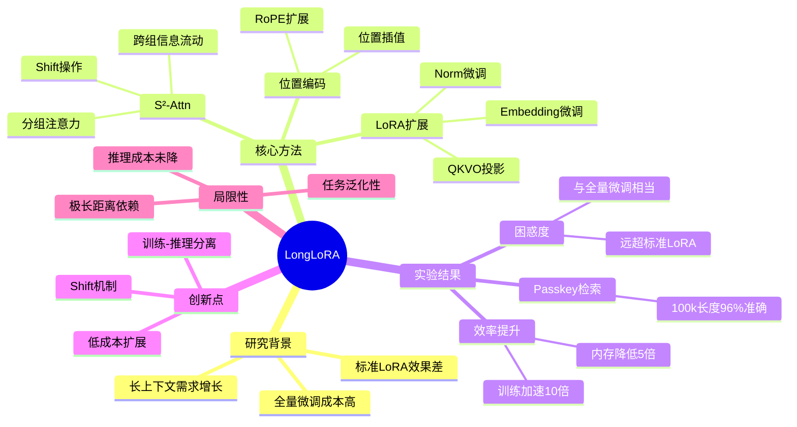

# LongLoRA: Efficient Fine-tuning of Long-Context Large Language Models

## 基本信息
- **标题**: LongLoRA: Efficient Fine-tuning of Long-Context Large Language Models
- **作者**: Yukang Chen, Shengju Qian, Haotian Tang, Xin Liao, Jizhong Han, Pengcheng He, Jianfeng Gao, Jiwen Lu, Yujun Lin, Song Han
- **机构**: The Chinese University of Hong Kong, MIT, S-Lab, NVIDIA, Tsinghua University, Microsoft
- **发表时间**: 2023 (arXiv:2309.12307)
- **论文链接**: https://arxiv.org/abs/2309.12307
- **本地PDF**: 已下载

## 一、研究背景与动机

### 问题背景
随着大语言模型的发展，长上下文能力变得越来越重要：
- 长文档理解与摘要
- 多轮对话记忆
- 代码库级别的理解与生成
- 复杂推理任务

### 现有方法的局限
1. **全量微调成本高**：扩展上下文窗口需要对位置编码进行全量微调，计算开销巨大
2. **LoRA直接应用效果差**：标准LoRA在扩展上下文长度时性能下降明显
3. **注意力机制复杂度**：标准自注意力复杂度为O(n²)，长序列下计算和内存开销巨大

### 研究动机
如何在**保持性能的同时，大幅降低长上下文微调的计算成本**？

## 二、核心贡献

1. **提出LongLoRA**：一种高效的长上下文微调方法，结合LoRA的低秩适配与改进的注意力机制
2. **设计$S^2$-Attn（Shift Short Attention）**：将长序列注意力分解为短序列注意力，大幅降低计算复杂度
3. **实证验证**：在LLaMA2系列模型上验证，可从2k扩展至100k tokens，性能与全量微调相当
4. **工程价值**：显著降低GPU内存需求，使普通研究者在单卡上也能进行长上下文微调

## 三、方法详解

### 3.1 整体框架

LongLoRA的核心思想是：**训练时使用稀疏注意力，推理时使用完整注意力**

```
┌─────────────────────────────────────────────────────────┐
│                    LongLoRA Framework                    │
├─────────────────────────────────────────────────────────┤
│  预训练模型 (LLaMA) + LoRA适配器 + $S^2$-Attn + 扩展RoPE │
│                                                          │
│  训练阶段: $S^2$-Attn (稀疏注意力)                        │
│  推理阶段: 标准注意力 (完整注意力)                         │
└─────────────────────────────────────────────────────────┘
```

### 3.2 LoRA扩展

标准LoRA仅在attention的Q、V投影上添加低秩适配器，LongLoRA进行了扩展：

**可训练组件**：
- **LoRA适配器**：应用于Q、K、V、O投影层
- **嵌入层**：对embedding进行微调
- **归一化层**：对LayerNorm进行微调

**关键发现**：仅训练LoRA层不足以获得好的长上下文性能，需要同时微调embedding和norm层。

### 3.3 $S^2$-Attn (Shift Short Attention)

这是LongLoRA的核心创新，解决长序列注意力计算效率问题。

**设计思路**：
1. **分组注意力**：将长度为L的序列分成g个长度为L/g的组，在组内进行注意力计算
2. **Shift操作**：相邻层之间对组进行shift，实现跨组信息流动

**数学表达**：
- 输入序列长度：L
- 分组数：g
- 每组长度：L/g
- 复杂度：从O(L²)降低到O(L²/g)

**Shift机制详解**：
```
Layer i:
  Group 1: [tokens 1-4]
  Group 2: [tokens 5-8]
  Group 3: [tokens 9-12]

Layer i+1 (shifted by half group):
  Group 1: [tokens 3-6]   # 跨越原Group 1和2
  Group 2: [tokens 7-10]  # 跨越原Group 2和3
  Group 3: [tokens 11-14]
```

通过多层堆叠，每个token最终可以"看到"整个序列的信息。

### 3.4 位置编码扩展

采用**位置插值(Position Interpolation)**方法扩展RoPE：

- 原始上下文长度：L₀
- 目标上下文长度：L
- 插值比例：s = L/L₀
- 位置编码调整：将位置索引从[0, L)压缩到[0, L₀)

## 四、实验设计与结果

### 4.1 实验设置

**基础模型**：LLaMA2系列（7B、13B、70B）

**扩展目标**：
- 7B/13B：从4k扩展到32k、64k、100k
- 70B：从4k扩展到32k

**训练配置**：
- 训练数据：PG19 + proof-pile-2（长文档数据集）
- 训练时长：约1000 GPU小时（LLaMA2 7B）

**评估基准**：
- 语言建模困惑度（Perplexity）
- 长文档理解任务
- Passkey检索任务

### 4.2 主要实验结果

#### 困惑度对比

| 模型 | 上下文长度 | 全量微调 | LongLoRA | 标准LoRA |
|------|-----------|---------|----------|----------|
| LLaMA2 7B | 32k | 5.44 | **5.48** | 6.92 |
| LLaMA2 7B | 64k | 5.12 | **5.16** | 8.74 |
| LLaMA2 7B | 100k | - | **4.97** | - |
| LLaMA2 13B | 64k | 4.68 | **4.70** | 6.42 |

#### Passkey检索任务

| 序列长度 | Full FT | LongLoRA | 标准LoRA |
|---------|---------|----------|----------|
| 16k | 100% | **100%** | 78% |
| 32k | 100% | **100%** | 52% |
| 64k | 100% | **98%** | 31% |
| 100k | - | **96%** | - |

### 4.3 效率分析

**GPU内存对比**（LLaMA2 7B，100k上下文）：

| 方法 | 内存占用 | 训练时间 |
|------|---------|---------|
| 全量微调 | ~80GB | 基线 |
| LongLoRA | **~16GB** | 快10倍+ |
| 标准LoRA | ~14GB | 快10倍+ |

### 4.4 消融实验

1. **$S^2$-Attn vs 其他注意力机制**
   - $S^2$-Attn性能最优
   - 简单分组注意力性能较差（缺乏跨组信息流动）
   - 全注意力计算成本过高

2. **可训练组件分析**
   - 仅LoRA：性能较差
   - LoRA + Embedding：性能提升
   - LoRA + Embedding + Norm：**最佳性能**

## 五、关键创新点

### 5.1 训练-推理分离策略

**核心洞察**：训练时不需要完整的注意力矩阵

- 训练阶段使用$S^2$-Attn（稀疏）
- 推理阶段使用标准注意力（完整）
- 两者数学等价，无需额外适配

### 5.2 Shift机制

通过简单的shift操作，在不增加计算量的情况下实现跨组信息流动：
- 每层只计算组内注意力
- 多层堆叠后信息全局传播
- 类似于卷积网络的感受野扩张

### 5.3 训练稳定性

相比其他长上下文扩展方法：
- 训练过程稳定
- 无需复杂的初始化或正则化
- 与标准LoRA训练流程兼容

## 六、局限性与未来工作

### 局限性
1. **推理成本未降低**：虽然训练效率提升，但推理时仍需完整注意力计算
2. **长距离依赖**：极端长距离依赖（如100k tokens跨度的依赖）可能仍有信息损失
3. **任务泛化**：在某些需要全局注意力的任务上可能略逊于全量微调

### 未来方向
1. 结合其他高效注意力机制（如FlashAttention）
2. 探索推理阶段的注意力稀疏化
3. 扩展到更多模型架构（如MoE模型）

## 七、个人思考

### 技术启发
1. **分治思想的巧妙应用**：将长序列问题分解为短序列问题，通过shift实现信息整合
2. **训练-推理分离**：打破"训练什么就用什么"的思维定式
3. **低成本实验**：使长上下文研究民主化，降低研究门槛

### 与相关工作的联系
- **位置插值**：LongLoRA建立在位置插值方法之上
- **LoRA**：对标准LoRA进行了扩展和改进
- **稀疏注意力**：$S^2$-Attn是一种特殊形式的稀疏注意力

### 实践价值
- 单卡即可进行长上下文微调
- 为开源模型长上下文能力提升提供了可行路径
- 可与QLoRA等量化方法结合，进一步降低成本

## 脑图结构



> 💡 **提示**：可将上述 Mermaid 代码粘贴到 [Mermaid Live Editor](https://mermaid.live/) 或支持 Mermaid 的编辑器中查看

## 相关论文

1. **LoRA: Low-Rank Adaptation of Large Language Models** (2021) - LoRA原始论文
2. **Extending Context Window of Large Language Models via Positional Interpolation** (2023) - 位置插值方法
3. **FlashAttention: Fast and Memory-Efficient Exact Attention** (2022) - 高效注意力实现
4. **Landmark Attention: Random-Access Infinite Context Length** (2023) - 另一种长上下文方法
5. **LongNet: Scaling Transformers to 1B Tokens** (2023) - 超长序列Transformer

## 参考文献

```bibtex
@article{chen2023longlora,
  title={LongLoRA: Efficient Fine-tuning of Long-Context Large Language Models},
  author={Chen, Yukang and Qian, Shengju and Tang, Haotian and Liao, Xin and others},
  journal={arXiv preprint arXiv:2309.12307},
  year={2023}
}
```
