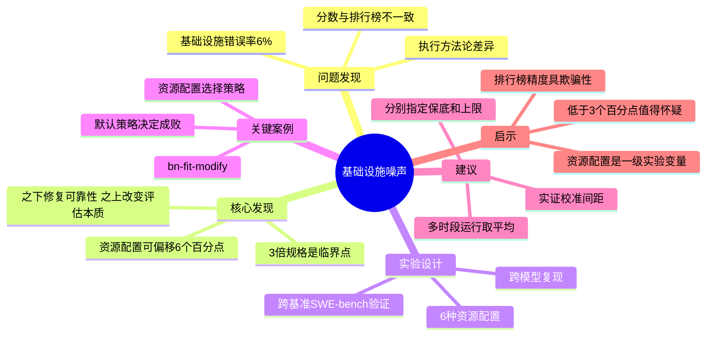

# Quantifying Infrastructure Noise in Agentic Coding Evals

## 基本信息
- **标题**: Quantifying Infrastructure Noise in Agentic Coding Evals
- **作者**: Gian Segato, Nicholas Carlini, Jeremy Hadfield, Mike Merrill, Alex Shaw
- **机构**: Anthropic
- **发表时间**: 2026年2月3日
- **论文链接**: https://www.anthropic.com/engineering/infrastructure-noise

## 一、研究背景与动机

当前 Agent 编码基准（如 SWE-bench、Terminal-Bench）的排行榜分数差异常被用来判断模型能力优劣，但这些基准忽略了一个关键变量：**基础设施配置**。

静态基准（如 MMLU）直接评估模型输出，运行环境与评分无关。但 Agent 编码基准有本质不同：模型在完整环境中编写代码、运行测试、安装依赖、多轮迭代——**运行时成为问题解决过程的组成部分**。正如文章所言："资源预算和时间限制不同的两个 Agent，不是在做同一份试卷。"

Anthropic 团队在 Google Kubernetes Engine 上运行 Terminal-Bench 2.0 校准时，发现分数与官方排行榜不一致，基础设施错误率高达 **6%**，且大多数 Pod 错误与模型能力无关。这促使他们系统性地研究基础设施噪声对 Agent 基准评估的影响。

## 二、核心贡献

1. **量化了基础设施噪声的量级**：资源配置差异可导致 Agent 编码基准分数偏移高达 6 个百分点——这通常超过排行榜上顶级模型之间的差距
2. **揭示了严格执行资源限制的陷阱**：将资源规格同时设为保底和上限时，瞬态峰值会导致 OOM Kill，制造与模型能力无关的失败
3. **识别了资源限制改变评估本质的临界点**：约 3 倍规格以下，额外资源修复基础设施可靠性问题；3 倍以上，额外资源使 Agent 能解决之前不可解的问题——评估测量的东西变了
4. **提出了可操作的评估标准化建议**：分别指定保证分配和硬性终止阈值，通过实证校准两者间距
5. **跨基准和跨模型验证**：在 SWE-bench 和多个 Anthropic 模型上复现了核心发现

## 三、方法详解

### 3.1 问题根源：执行方法论的差异

容器运行时使用两个参数：
- **保证分配（guaranteed allocation）**：最低资源保障
- **终止阈值（kill threshold）**：触发 OOM Kill 的上限

Terminal-Bench 的官方沙箱提供者允许临时超额分配以维持稳定性。而 Anthropic 的 Kubernetes 设置将每任务规格同时作为保底和硬上限——容器超出限制后立即被杀。当两者设为相同时，**零余量**应对瞬态峰值，一次短暂的内存波动就能 OOM Kill 一个本应成功的容器。

### 3.2 实验设计

在 6 种资源配置下运行 Terminal-Bench 2.0，从严格执行（1x，规格同时为保底和上限）到完全无限制。其他条件全部恒定：相同的 Claude 模型、相同的 Harness、相同的任务集。

### 3.3 跨基准验证（SWE-bench）

在 SWE-bench 上进行交叉实验，将 RAM 从基线变化到 5 倍，覆盖 227 个问题，每个 10 个样本。

### 3.4 跨模型复现

在不同 Anthropic 模型上复现核心发现，效应方向一致，量级随模型变化。

## 四、实验设计与结果

### 4.1 基础设施错误率

| 配置 | 基础设施错误率 |
|------|---------------|
| 1x（严格执行） | 5.8% |
| 3x | 2.1% |
| Uncapped | 0.5% |

从 1x 到 3x 的降低在 p < 0.001 水平上统计显著。

### 4.2 成功率

| 资源范围 | 效应 |
|---------|------|
| 1x–3x | 成功率在噪声范围内波动（p = 0.40），1x 崩溃的任务多数本就会失败 |
| 3x–Uncapped | 基础设施错误再降 1.6 个百分点，成功率跃升近 4 个百分点 |
| 1x vs Uncapped | **总提升 +6 个百分点**（p < 0.01） |

### 4.3 SWE-bench 交叉验证

| 配置 | 分数变化 |
|------|---------|
| 5x vs 1x | 仅 +1.54 个百分点 |

SWE-bench 任务资源密集度较低，但资源分配仍非中性。

### 4.4 关键案例：bn-fit-modify

贝叶斯网络拟合任务：某些模型的默认策略是安装 pandas、networkx、scikit-learn 及其完整工具链。在宽裕限制下可行；在紧张限制下，Pod 在安装阶段就 OOM，还没写出任何解决代码。更精简的策略（用标准库从头实现数学计算）存在，但并非所有模型默认采用。

**核心洞见**："不同模型有不同的默认策略，资源配置决定了哪些策略恰好能成功。"

### 4.5 其他方差来源

- **时间限制**：某些配置下影响结果
- **集群健康、硬件规格、并发级别、出口带宽**：Agent 评估是端到端系统测试，任何组件都可能是混淆因素
- **时段效应**：观察到通过率随一天中的时间波动，可能源于 API 延迟随流量模式变化

## 五、关键创新点

1. **"基础设施噪声"概念的精确量化**：首次用受控实验证明 Agent 基准评估中基础设施配置可造成 6 个百分点的分数偏移
2. **"评估本质改变"的临界点识别**：3 倍规格是一个关键分水岭——之下修复可靠性，之上改变评估内容
3. **"两个参数"方法论**：提出评估应分别指定保证分配和终止阈值，而非单一固定值，从根本上解决瞬态峰值问题
4. **实证校准方法**：通过调整上限和保底间距直到两端分数落在噪声范围内，提供可操作的标准化路径

## 六、局限性与未来工作

### 局限性

1. **非 Claude 模型验证不充分**：趋势看起来对非 Claude 模型也成立，但尚未完成严格测试
2. **临界点的普适性**：3 倍规格的临界点可能因基准而异，文章仅基于 Terminal-Bench 2.0 和 SWE-bench
3. **其他噪声源未完全量化**：API 延迟波动、时段效应等因素仅定性描述，未给出定量分析
4. **理想方案的实践障碍**：在相同硬件条件下运行评估最为理想，但公开评估中难以实现

### 未来方向

1. 基准维护者应将执行方法论与资源规格一同指定
2. 基准消费者应理解小分数差异携带的不确定性远超报告数字的精度所暗示
3. 将资源配置视为与 prompt 格式、采样温度同等的一级实验变量

## 七、个人思考

### 核心洞见
这篇文章最深刻的观点是：**资源限制不仅影响评估的精度，还改变了评估的本质**。当资源配置从"紧张"变为"宽裕"时，评估从"测哪个 Agent 更高效"变成了"测哪个 Agent 更能利用资源"——这是两个不同的能力维度。

### 对 Agent 评估的启示
1. **排行榜的表面精度具有欺骗性**：2 个百分点的领先可能反映真实能力差距，也可能只是更大的 VM
2. **评估是端到端系统测试**：Agent 评估不是纯模型测试，任何系统组件都是潜在的混淆因素
3. **默认策略的隐含假设**：不同模型的"默认做事方式"不同，资源配置在隐含地选择哪种策略能成功
4. **标准化需深入到执行层面**：仅规定资源规格不够，还需规定执行方法论（如何执行限制）

### 与相关工作的联系
- 与传统软件基准测试中的"环境变量控制"问题类似，但 Agent 评估的复杂性远超传统基准
- 与 ML 可复现性危机一脉相承——但 Agent 评估中基础设施的影响量级（6 个百分点）远超传统训练可复现性的波动
- 与"评估即产品"的理念呼应：评估工具本身的设计选择（如何执行限制）成为了评估结果的一部分

### 关键阈值
文章提出了一个实用经验法则：**在资源方法论标准化之前，排行榜上低于 3 个百分点的差距值得怀疑，直到评估配置被文档化并对齐。**

## 脑图结构

> 💡 **提示**：可将上述 Mermaid 代码粘贴到 [Mermaid Live Editor](https://mermaid.live/) 或支持 Mermaid 的编辑器中查看

## 相关论文

- [SWE-bench: Can Language Models Resolve Real-World GitHub Issues?](https://arxiv.org/abs/2310.06770) — 本文核心验证基准之一
- [Terminal-Bench](https://terminal-bench.com/) — 本文主要研究对象，端到端评估 LLM 终端操作能力的基准
- [Holistic Evaluation of Language Models (HELM)](https://arxiv.org/abs/2211.09110) — LLM 评估方法论的经典框架
- [Scaling Managed Agents: Decoupling the Brain from the Hands](https://www.anthropic.com/engineering/managed-agents) — 同为 Anthropic 的 Agent 基础设施研究，互补视角
- [BigBench](https://arxiv.org/abs/2206.04615) — 大规模基准测试，静态评估的代表

## 参考文献

- Terminal-Bench 2.0 — 首个指定每任务 CPU 和 RAM 推荐的 Agent 基准
- Container Runtime 资源管理 — guaranteed allocation 与 kill threshold 的双参数设计
- Kubernetes Resource Enforcement — GKE 上的严格执行 vs. 宽裕执行
- Binomial Confidence Intervals — 1-2 个百分点的统计噪声基线
