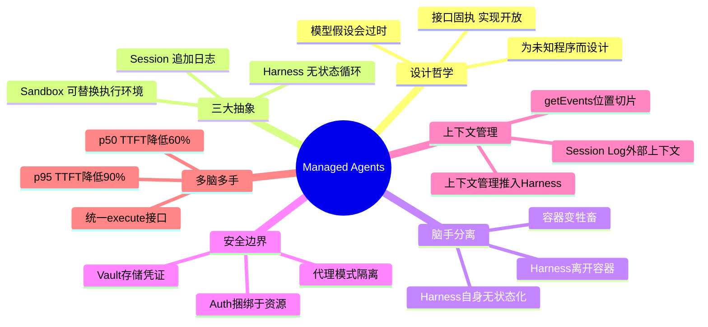

# Scaling Managed Agents: Decoupling the Brain from the Hands

## 基本信息
- **标题**: Scaling Managed Agents: Decoupling the Brain from the Hands
- **作者**: Lance Martin, Gabe Cemaj, Michael Cohen
- **机构**: Anthropic
- **发表时间**: 2026年2月4日
- **论文链接**: https://www.anthropic.com/engineering/managed-agents

## 一、研究背景与动机

Agent 系统设计中存在一个反复出现的核心问题：**Harness（控制框架）会编码关于模型能力局限性的假设，而这些假设随着模型能力提升而过时（go stale）**。

典型案例：Claude Sonnet 4.5 表现出"上下文焦虑"——在接近上下文窗口限制时过早结束任务。为此，Harness 中加入了上下文重置机制。但当同一个 Harness 用于 Claude Opus 4.5 时，这种行为已完全消失，重置机制反而成了不必要的开销。

这引出了一个更深层的架构问题：如何设计一个能超越特定模型实现、适应未来模型能力演化的 Agent 系统？

## 二、核心贡献

1. **提出"脑手分离"架构范式**：将 Agent 的 Brain（推理）、Hands（执行）、Session（状态）解耦为独立接口，各组件可独立替换和故障恢复
2. **设计面向未来的稳定接口**：借鉴操作系统虚拟化硬件的思路（process、file 抽象），定义了 Session、Harness、Sandbox 三大抽象，使其能适应未知模型的未来需求
3. **实现凭证隔离的安全边界**：通过 Auth-bundled-with-resources 和 Vault-stored credentials 两种模式，确保 Agent 永远不直接接触敏感凭证
4. **将 Session 作为外部上下文对象**：突破上下文窗口限制，Session Log 作为持久化的上下文对象，支持灵活的位置切片查询
5. **验证多脑多手的扩展性**：解耦后 p50 TTFT 降低约 60%，p95 TTFT 降低超过 90%

## 三、方法详解

### 3.1 设计哲学：为未知的程序而设计

核心类比来自操作系统设计：操作系统通过将硬件虚拟化为 *process* 和 *file* 等抽象，使 `read()` 命令在 1970 年的磁盘和现代 SSD 上工作方式完全一致。

Managed Agents 将同样的模式应用于 Agent 组件虚拟化：

| 抽象 | 定义 | 关键特性 |
|------|------|----------|
| **Session** | 发生的一切的追加日志 | 持久化、可恢复 |
| **Harness** | 调用 Claude 并路由工具调用的循环 | 无状态、可重启 |
| **Sandbox** | 代码和文件编辑的执行环境 | 可替换、可扩展 |

**核心原则**：对接口形状保持固执（opinionated），对接口背后的实现保持开放。

### 3.2 从"宠物"到"牲畜"的架构演进

**初始架构（单容器耦合）**：Session、Harness、Sandbox 全部运行在一个容器中。优势是直接系统调用，无需服务边界设计；但形成了"宠物"——一个不可丢失的手工照料实例。

**问题**：
- 容器故障 = Session 丢失，无响应容器需要人工修复
- 调试几乎不可能——只有 WebSocket 事件流，无法定位故障位置
- 基础设施锁定——需要访问 VPC 的客户必须网络对等或自行运行 Harness

**解耦架构**：将 Brain、Hands、Session 分离为独立接口，各自可独立故障和替换。

### 3.3 Harness 离开容器

Harness 不再驻留在容器内，而是将容器当作工具调用：`execute(name, input) → string`。

容器变成"牲畜"——如果容器死亡，Harness 将失败作为工具调用错误捕获并返回给 Claude，新容器可通过 `provision({resources})` 初始化。

### 3.4 Harness 自身的故障恢复

Harness 本身也变成了"牲畜"。由于 Session Log 驻留在 Harness 之外，Harness 内部不需要任何可存活状态。恢复机制：
- `wake(sessionId)` — 重启一个新的 Harness
- `getSession(id)` — 检索事件日志
- `emitEvent(id, event)` — 在 Agent 循环中持久记录事件

Harness 从最后一个事件恢复执行。

### 3.5 安全边界：凭证隔离

耦合设计中，Claude 生成的不可信代码与凭证运行在同一容器中。Prompt 注入可诱导 Claude 读取自身环境变量，提取 Token 来生成无限制会话。

**两种凭证隔离模式**：

1. **Auth 捆绑于资源**：以 Git 为例，每个仓库的访问 Token 在 Sandbox 初始化时用于 clone 仓库并配置本地 git remote，`push`/`pull` 无需 Agent 接触 Token
2. **Vault 存储凭证**：对于通过 MCP 的自定义工具，OAuth Token 存储在安全 Vault 中。Claude 通过专用代理调用 MCP 工具，代理使用 Session Token 从 Vault 获取凭证进行外部调用，Harness 永远看不到凭证

### 3.6 Session 不是 Claude 的上下文窗口

长时任务经常超出上下文窗口长度。传统方法（压缩/记忆工具/上下文裁剪）都涉及关于保留什么内容的不可逆决策，且难以预测未来回合需要哪些 Token。

Managed Agents 中，**Session Log 作为持久化的上下文对象存在于上下文窗口之外**。`getEvents()` 接口允许 Brain 灵活查询事件流的位置切片：
- 从上次停止阅读的位置继续
- 回退查看特定时刻前的上下文
- 重新阅读特定动作前的上下文

获取的事件可在 Harness 中转换后再传入 Claude 的上下文窗口，支持 prompt cache 优化、上下文工程等操作。分离确保了 Session 中的持久化可恢复上下文存储，同时将任意的上下文管理推入 Harness——因为未来模型的具体需求是不可预测的。

### 3.7 多脑多手

**多脑（Many Brains）**：
- 解耦解决了客户 VPC 访问问题——不再需要网络对等
- 性能提升显著：推理在拉取待处理事件后立即开始，容器按需供给
  - p50 TTFT 降低约 **60%**
  - p95 TTFT 降低超过 **90%**
- 扩展到多脑 = 启动多个无状态 Harness，按需连接 Hands

**多手（Many Hands）**：
- 每个 Brain 可连接多个 Hands，Claude 推理多个执行环境并决定工作路由
- 早期模型无法处理，单容器即可；随智能提升，单容器成为瓶颈
- 统一接口 `execute(name, input) → string` 支持任何自定义工具、MCP Server 或 Anthropic 自有工具
- Harness 不知道 Sandbox 是"容器、手机还是 Pokémon 模拟器"
- Brain 之间可互相转移 Hands

## 四、实验设计与结果

### 性能优化结果

| 指标 | 改善幅度 |
|------|----------|
| p50 TTFT（首 Token 时间） | 降低约 60% |
| p95 TTFT | 降低超过 90% |

### 架构对比

| 维度 | 耦合架构（单容器） | 解耦架构 |
|------|-------------------|----------|
| 故障恢复 | 手工修复容器 | 自动捕获错误、重新供给 |
| 调试能力 | 仅 WebSocket 事件流 | 组件独立可观测 |
| VPC 访问 | 需网络对等 | 直接连接 |
| 凭证安全 | 同容器运行风险 | Vault 代理隔离 |
| 扩展模式 | 单实例瓶颈 | 多脑多手弹性扩展 |
| TTFT 开销 | 全量容器启动成本 | 按需供给、即时推理 |

## 五、关键创新点

1. **"脑手分离"架构范式**：借鉴操作系统虚拟化思路，将 Agent 分解为 Session/Harness/Sandbox 三大抽象接口，实现面向未来模型能力的架构弹性
2. **Harness 无状态化**：Harness 作为无状态的"牲畜"，通过 Session Log 持久化实现故障恢复，彻底解决了单点故障问题
3. **Session Log 作为外部上下文对象**：突破了上下文窗口的硬限制，将上下文管理从"不可逆裁剪"转变为"可编程查询"
4. **凭证隔离的安全设计**：Auth-bundled-with-resources + Vault proxy 双模式，从架构层面消除了 Prompt 注入窃取凭证的风险
5. **统一工具接口**：`execute(name, input) → string` 的极简抽象，使 Harness 对底层执行环境完全无感知，实现了真正的可替换性

## 六、局限性与未来工作

### 文章未深入讨论的局限

1. **多脑协调的复杂性**：多个 Brain 之间如何协调共享状态、避免冲突，文章仅提到"可转移 Hands"但未详述协调机制
2. **Session Log 的查询效率**：长时间任务的 Session Log 可能非常庞大，`getEvents()` 的性能特征和优化策略未讨论
3. **多手场景的认知负荷**：Claude 需要推理多个执行环境并决定工作路由，这对模型能力的更高要求可能成为新的瓶颈
4. **安全边界的新风险**：Vault proxy 本身成为新的攻击面，其安全性假设未深入分析

### 未来方向

1. 适应更智能模型的多脑多手编排策略
2. 更精细的上下文工程和 Prompt Cache 优化
3. 支持 Claude Code 和特定领域 Agent Harness 的多样化接入

## 七、个人思考

### 核心洞见
这篇文章最深刻的洞见是：**Harness 编码的模型能力假设会过时**。这不是一个工程问题，而是一个架构哲学问题。当模型能力持续快速演进时，系统的设计必须面向"未知的未来"，而非"已知的现在"。这与操作系统设计中"为未写的程序而设计"的思路高度一致。

### 与相关工作的联系
- 与微服务架构的"数据库每服务一个"原则类似，解耦的本质是消除共享状态带来的耦合
- Session Log 作为外部上下文对象的设计，与 Event Sourcing 模式异曲同工——用事件序列替代可变状态
- 安全边界的 Vault 代理模式，与零信任架构中的"永不信任，始终验证"原则一致

### 对 Agent 系统设计的启示
1. **接口优于实现**：定义稳定的接口形状，允许实现自由演化
2. **无状态优先**：将状态外置到持久化存储，使计算组件可随时替换
3. **安全从架构入手**：凭证隔离应作为架构约束而非补丁
4. **面向扩展设计**：假设未来的模型比现在更强，系统不应因模型能力提升而产生冗余开销

## 脑图结构

> 💡 **提示**：可将上述 Mermaid 代码粘贴到 [Mermaid Live Editor](https://mermaid.live/) 或支持 Mermaid 的编辑器中查看

## 相关论文

- [Constitutional AI: Harmlessness from AI Feedback](https://arxiv.org/abs/2212.08073) — Anthropic 对齐方法论，Agent 安全的基础
- [Toolformer](https://arxiv.org/abs/2302.04761) — LLM 自学使用工具，Agent 工具使用的早期探索
- [ReAct](https://arxiv.org/abs/2210.03629) — 推理+行动的 Agent 范式，Harness 设计的理论基础
- [Reflexion](https://arxiv.org/abs/2303.11366) — Agent 自我反思，Session Log 设计的相关思路
- [MCP (Model Context Protocol)](https://modelcontextprotocol.io/) — Anthropic 提出的工具接入协议，与本文 MCP 工具集成直接相关

## 参考文献

- Operating Systems: Three Easy Pieces — 操作系统虚拟化设计的经典参考
- Event Sourcing Pattern — 事件溯源架构模式，与 Session Log 设计思路一致
- Pets vs Cattle — 云计算基础设施的运维哲学
- [Managed Agents Documentation](https://platform.claude.com/docs/en/managed-agents/overview) — Anthropic 官方文档
