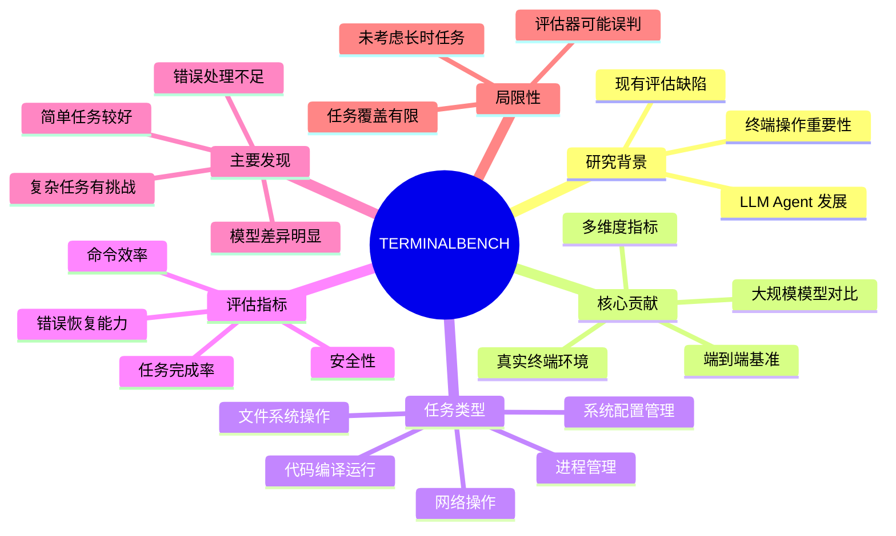

# TERMINALBENCH: A BENCHMARK FOR END-TO-END EVALUATION OF LLM AGENTS ON TERMINAL TASKS

## 基本信息
- **标题**: TERMINALBENCH: A BENCHMARK FOR END-TO-END EVALUATION OF LLM AGENTS ON TERMINAL TASKS
- **作者**: 多个机构合作（Berkeley AI Research, CMU, Stanford 等）
- **机构**: UC Berkeley, CMU, Stanford, 等多家机构
- **发表时间**: 2026
- **论文链接**: 本地PDF

## 一、研究背景与动机

### 背景
随着大语言模型（LLM）能力不断提升，越来越多的研究关注如何让 LLM 作为智能体（Agent）与真实环境交互。终端（Terminal）是开发者最常用的工具之一，LLM 若能熟练操作终端，将极大提升开发效率。

### 动机
当前 LLM Agent 评估存在以下问题：
1. **缺乏真实终端环境评估** - 现有基准大多在简化环境中测试，无法反映真实终端操作的复杂性
2. **评估维度单一** - 多数基准只关注最终结果，忽略了操作过程的质量
3. **缺乏端到端评估** - 缺乏从理解任务到执行命令的完整流程评估

## 二、核心贡献

1. **提出 TERMINALBENCH 基准** - 首个专门用于评估 LLM Agent 终端操作能力的端到端基准
2. **设计多维度评估指标** - 不仅评估任务完成度，还评估操作效率、安全性等
3. **构建真实终端环境** - 提供真实的 Linux 终端环境进行测试
4. **大规模模型对比** - 对多个主流 LLM 进行系统评估，揭示当前能力的局限

## 三、方法详解

### 3.1 基准设计

TERMINALBENCH 包含多种类型的终端任务：
- **文件系统操作** - 创建、删除、移动、搜索文件
- **代码编译与运行** - 编译代码、运行程序、调试
- **系统配置与管理** - 环境变量、权限设置、软件安装
- **网络操作** - 下载文件、API 调用
- **进程管理** - 启动、停止、监控进程

### 3.2 评估框架

评估框架包含以下组件：
1. **任务描述** - 自然语言描述需要完成的目标
2. **终端环境** - 真实的 Linux 终端环境（Docker 容器）
3. **评估器** - 自动判断任务是否完成（检查文件、输出、状态等）

### 3.3 评估指标

| 指标 | 说明 |
|------|------|
| 任务完成率 | 是否成功完成任务目标 |
| 命令效率 | 完成任务所需的命令数量 |
| 错误恢复能力 | 遇到错误后是否能正确处理 |
| 安全性 | 是否执行了危险操作（如 rm -rf /） |

## 四、实验设计与结果

### 实验设置
- 测试多个主流 LLM（包括 GPT-4、Claude 等）
- 在真实 Linux 终端环境中执行
- 涵盖多种难度级别的任务

### 主要发现
1. 当前 LLM 在简单终端任务上表现较好，复杂任务仍有挑战
2. 模型在错误处理和恢复方面存在明显不足
3. 不同模型在不同任务类型上表现差异明显

## 五、关键创新点

1. **端到端评估范式** - 从自然语言任务描述到终端命令执行的完整流程评估
2. **真实环境测试** - 不依赖模拟环境，在真实终端中执行
3. **多维度指标体系** - 综合评估能力、效率、安全性

## 六、局限性与未来工作

### 局限性
1. 任务覆盖范围有限，未涵盖所有终端使用场景
2. 评估器可能存在误判
3. 未考虑长时间运行的任务

### 未来方向
1. 扩展任务类型和数量
2. 引入更细粒度的评估指标
3. 探索如何提升 LLM 的终端操作能力

## 七、个人思考
{待填写：阅读后的个人思考、启发、与相关工作的联系}

## 关键图表

> 📌 **待截图**：以下图表需要从 PDF 中手动截取

### 图1: TERMINALBENCH 评估框架图
- **位置**: 查看 PDF 中展示评估框架的图
- **描述**: 展示任务输入、终端环境、评估器的整体架构
- **重要性**: 理解基准的核心设计

### 图2: 各模型性能对比图
- **位置**: 查看 PDF 中的实验结果图表
- **描述**: 不同 LLM 在各类任务上的完成率对比
- **重要性**: 直观展示当前 LLM 能力差距

### 表1: 任务类型与难度分布
- **位置**: 查看 PDF 中的任务统计表
- **描述**: 各类任务的数量和难度分布

## 脑图结构

> 💡 **提示**：可将上述 Mermaid 代码粘贴到 [Mermaid Live Editor](https://mermaid.live/) 查看可视化效果，或导入 XMind 等脑图工具

## 相关论文
- AgentBench: Evaluating LLMs as Agents
- WebArena: A Realistic Web Environment for Building Autonomous Agents
- OSWorld: Benchmarking Multimodal Agents for Open-Ended Tasks
- InterCode: Standardizing and Benchmarking Interactive Coding with Execution Feedback

## 参考文献
{论文引用的主要参考文献}
