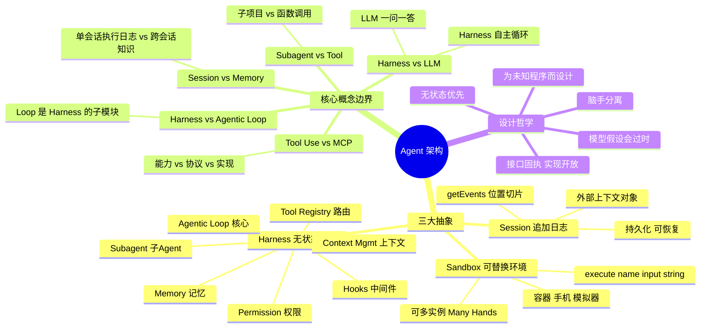

# Anthropic Agent 架构全景解读

> 本文基于 Anthropic 官方论文 *Scaling Managed Agents: Decoupling the Brain from the Hands*（2026.02）及 Claude Agent SDK 文档，系统梳理 Agent 架构中各模块的定义、边界与协作关系。
> 前置要求：了解 LLM 基础概念（Token、上下文窗口、Tool Use / Function Calling），知道 ReAct 范式即可。

---

## 一、从 LLM 到 Agent：到底多了什么？

一个裸 LLM 只能做一件事：**给定输入，生成输出**（`prompt → completion`）。

```
用户: "巴黎天气如何？"
LLM:  "巴黎今天15°C，多云转晴。"
```

Agent 在此基础上加了三样东西：

| 增量能力 | 作用 | 类比 |
|----------|------|------|
| **工具调用（Tool Use）** | LLM 不只是说话，还能"动手"——读写文件、执行命令、搜索网页 | 给盲人一根手杖 |
| **自主循环（Agentic Loop）** | 不再一问一答，而是"思考→选工具→执行→观察→再思考"反复迭代 | 从"问答模式"变成"项目经理模式" |
| **状态管理（Session）** | 跨轮次记忆执行历史、中间结果、用户偏好 | 从"无状态 HTTP"变成"有状态 Session" |

这三样东西不是独立拼装的，它们被**Harness** 统一管理。下面逐层展开。

---

## 二、Harness：到底什么意思？

### 2.1 一句话定义

**Harness 是把裸 LLM 包装成自主 Agent 的全部运行时代码。**

它不是一个函数或一个类，而是一整套基础设施的统称。类比：HTTP 服务器不是某个函数，而是监听端口、解析请求、路由分发、返回响应的整个运行时。

### 2.2 Anthropic 官方定义（来自论文）

论文中对 Harness 的精确定义：

> **Harness = 调用 Claude 并路由工具调用的循环。无状态、可重启。**

关键属性：
- **无状态**：Harness 内部不保存任何需要存活的数据。所有状态外置到 Session Log。
- **可重启**：Harness 挂了，启动一个新的，从 Session Log 最后一个事件继续执行。
- **模型无关的接口**：对接口形状保持固执（opinionated），对接口背后的实现保持开放。

### 2.3 Harness 包含哪些子模块？

```
┌─────────────────────────── Harness ───────────────────────────────────┐
│                                                                       │
│  ┌─────────────────────────────────────────────────────────────────┐ │
│  │                  Agentic Loop（智能体循环）                      │ │
│  │                                                                  │ │
│  │  ┌──────────┐    ┌──────────┐    ┌──────────┐    ┌──────────┐  │ │
│  │  │  Think   │ →  │  Select  │ →  │ Execute  │ →  │ Observe  │  │ │
│  │  │  推理    │    │  选工具   │    │  执行    │    │  观察结果 │  │ │
│  │  └──────────┘    └──────────┘    └──────────┘    └──────────┘  │ │
│  │       ↑                                                │        │ │
│  │       └──────────── 继续循环 / 结束 ────────────────────┘        │ │
│  └─────────────────────────────────────────────────────────────────┘ │
│                                                                       │
│  ┌────────────────┐  ┌──────────────┐  ┌──────────────────────────┐  │
│  │ Tool Registry   │  │ Permission    │  │ Hooks                    │  │
│  │ 工具注册与路由   │  │ 权限边界控制   │  │ 生命周期中间件           │  │
│  └────────────────┘  └──────────────┘  └──────────────────────────┘  │
│                                                                       │
│  ┌────────────────┐  ┌──────────────┐  ┌──────────────────────────┐  │
│  │ Context Mgmt    │  │ Subagent Mgmt │  │ Session I/O              │  │
│  │ 上下文管理       │  │ 子 Agent 调度  │  │ 会话日志读写             │  │
│  └────────────────┘  └──────────────┘  └──────────────────────────┘  │
│                                                                       │
│  ┌──────────────────────────────────────────────────────────────────┐│
│  │ Memory（记忆模块）                                                 ││
│  └──────────────────────────────────────────────────────────────────┘│
└───────────────────────────────────────────────────────────────────────┘
```

逐个解释：

### 2.3.1 Agentic Loop（智能体循环）

Harness 的心脏。每一轮（turn）的执行流程：

```
1. 将当前消息列表发送给 Claude API（POST /v1/messages）
2. 接收响应，检查 stop_reason：
   - "end_turn"     → 任务完成，退出循环
   - "tool_use"     → 有工具需要调用，继续
   - "pause_turn"   → 服务端工具达到迭代上限，重新发送继续
   - "max_tokens"   → 输出被截断，增大 max_tokens 重试
3. 执行工具调用，收集结果
4. 将工具结果追加到消息列表
5. 回到步骤 1
```

这不是什么复杂算法，就是一个 `while True` 循环。真正的复杂性在于循环内部各模块的协作。

### 2.3.2 Tool Registry（工具注册与路由）

管理和路由所有可用工具。工具分为两类：

**内置工具（Built-in Tools）：**

| 工具 | 能力 | 执行位置 |
|------|------|----------|
| Read | 读取文件 | 客户端 |
| Write | 创建文件 | 客户端 |
| Edit | 精确编辑文件 | 客户端 |
| Bash | 执行 shell 命令 | 客户端 |
| Glob | 按模式查找文件 | 客户端 |
| Grep | 按内容搜索文件 | 客户端 |
| WebSearch | 搜索互联网 | 服务端 |
| WebFetch | 抓取网页内容 | 服务端 |
| Code Execution | 在沙箱中执行代码 | 服务端（Anthropic 容器） |
| Agent | 派生子 Agent | Harness 内部 |

**外部工具（MCP Tools）：**

通过 MCP（Model Context Protocol）协议接入的第三方工具，如 Playwright（浏览器自动化）、数据库连接器等。统一接口：

```
execute(name, input) → string
```

Harness 不知道工具背后的实现是什么——容器、手机、还是 Pokemon 模拟器，对它来说都只是一个 `name + input → output` 的调用。

### 2.3.3 Permission System（权限系统）

在 Agentic Loop 中插入安全检查点，防止 Agent 做出危险操作：

```
Agent 请求执行 "rm -rf /tmp/project"
      ↓
Permission System 检查
      ↓
  该操作是否在 allowed_tools 中？
      ├── 是 → 自动批准执行
      └── 否 → 根据 permission_mode 决定：
            ├── "default" → 弹窗让用户确认
            ├── "plan" → 拒绝（只规划不执行）
            └── "bypassPermissions" → 跳过（仅限可信环境）
```

论文中的安全设计更进一步：凭证与执行环境隔离，Agent 永远不直接接触敏感 Token。

### 2.3.4 Hooks（钩子 / 中间件）

在 Agentic Loop 的关键节点插入自定义逻辑，类似 Web 框架的 middleware：

```
用户提交 Prompt
    ↓
[UserPromptSubmit hook] ← 可以修改/拒绝用户输入
    ↓
Claude 推理中...
    ↓
Claude 决定调用工具
    ↓
[PreToolUse hook] ← 可以拦截/修改工具调用
    ↓
执行工具
    ↓
[PostToolUse hook] ← 可以记录审计日志
    ↓
工具结果返回给 Claude
    ↓
... 继续循环 ...
```

可用 hook 事件：`PreToolUse`、`PostToolUse`、`PostToolUseFailure`、`UserPromptSubmit`、`Stop`、`SubagentStart`、`SubagentStop`、`PreCompact` 等。

### 2.3.5 Context Management（上下文管理）

Agent 执行长任务时，对话历史会超出上下文窗口（200K token）。Harness 需要处理这个问题：

- **Compaction（压缩）**：当接近上下文窗口上限时，自动将早期上下文摘要化，用压缩块替代原始内容。压缩块必须传回 API，否则上下文状态丢失。
- **Prompt Caching（缓存）**：对不变的 system prompt 和工具定义做前缀缓存，减少重复计费。缓存是前缀匹配，任意字节变化都会失效。
- **Session Log 作为外部上下文**（论文核心设计）：Session Log 持久化在 Harness 之外，通过 `getEvents(start, end)` 按位置切片查询。上下文窗口里只放"当前需要的片段"，而不是全部历史。

### 2.3.6 Subagent Management（子 Agent 管理）

主 Agent 可以 spawn 子 Agent 处理独立子任务：

```
主 Agent: "Review 这个代码库"
    ↓
spawn code-reviewer agent（独立 prompt + 工具集 + 权限）
    ↓
子 Agent 独立执行 Agentic Loop
    ↓
返回结果给主 Agent
```

每个子 Agent 有自己的：
- `prompt`：专门化的指令
- `tools`：受限的工具子集
- `permission_mode`：独立的权限策略
- `cwd`：独立的工作目录

子 Agent 之间可以转移 Hands（执行环境），实现并行协作。

### 2.3.7 Session I/O（会话日志读写）

 Harness 通过 Session I/O 与外部 Session Log 交互：

```
emitEvent(sessionId, event)  → 写入一条事件
getSession(sessionId)        → 读取完整日志
getEvents(sessionId, start, end) → 按位置切片读取
wake(sessionId)              → 从最后事件恢复执行
```

Session Log 是 Agent 的"单一事实来源"——所有操作、工具调用、中间结果都追加记录于此。

### 2.3.8 Memory（记忆模块）

Memory 是 Harness 中一个特殊的横切模块，它让 Agent 具备**跨会话的持久化记忆**。

**与 Session 的区别：**

| 维度 | Session | Memory |
|------|---------|--------|
| 生命周期 | 单次任务会话内 | 跨会话持久化 |
| 内容 | 完整的执行轨迹（工具调用、中间结果） | 结构化的知识（用户偏好、项目背景） |
| 写入方式 | 自动追加（每轮都记录） | Agent 主动决定何时写入 |
| 读取方式 | 按位置切片恢复上下文 | 启动时自动加载相关的记忆片段 |

**Memory 的运作机制：**

```
会话开始
    ↓
Harness 扫描 memory 目录，加载相关记忆文件
    ↓
注入 system prompt（作为上下文的一部分）
    ↓
Agent 执行过程中，通过 memory tool 读写记忆
    ↓
会话结束，记忆文件持久化到磁盘
    ↓
下次会话启动时，新的 Harness 实例重新加载这些记忆
```

Memory tool（`memory_20250818`）提供的操作：`view`、`create`、`str_replace`、`insert`、`delete`、`rename`——本质上是一个文件系统 CRUD 接口，但语义上是"Agent 的长期记忆"。

---

## 三、三大抽象：Session / Harness / Sandbox

论文将整个 Agent 系统提炼为三个核心抽象。它们之间的关系：

```
┌─────────────────────────────────────────────────────────────────┐
│                        Session（追加日志）                        │
│                                                                  │
│  event_1 → event_2 → event_3 → ... → event_n                   │
│                                                                  │
│  持久化、可恢复、可切片查询。存储在 Harness 之外。                   │
└──────────────────────────┬──────────────────────────────────────┘
                           │ 读写
                           ↓
┌─────────────────────────────────────────────────────────────────┐
│                        Harness（无状态循环）                       │
│                                                                  │
│  调用 Claude → 路由工具 → 写入事件 → 读取事件 → 循环              │
│                                                                  │
│  无状态、可重启、可水平扩展。                                      │
└──────────────────────────┬──────────────────────────────────────┘
                           │ execute(name, input) → string
                           ↓
┌─────────────────────────────────────────────────────────────────┐
│                      Sandbox（可替换执行环境）                     │
│                                                                  │
│  容器、手机、Pokemon 模拟器...Harness 不关心具体是什么。            │
│                                                                  │
│  可替换、可扩展、可多实例。                                        │
└─────────────────────────────────────────────────────────────────┘
```

**设计哲学**：对接口形状保持固执（opinionated），对接口背后的实现保持开放。

| 抽象 | 一句话 | 关键特性 | 类比 |
|------|--------|----------|------|
| Session | 发生的一切的追加日志 | 持久化、可恢复 | Git 的 commit log |
| Harness | 调用 Claude 并路由工具的循环 | 无状态、可重启 | HTTP 服务器 |
| Sandbox | 代码和文件编辑的执行环境 | 可替换、可扩展 | Docker 容器 |

---

## 四、概念边界辨析

### 4.1 Harness vs LLM

```
LLM:        "给定这个 prompt，生成下一个 token"
Harness:    "让 LLM 在循环中自主工作，直到任务完成"
```

LLM 是大脑，Harness 是中枢神经系统。没有 Harness，LLM 只能一问一答；有了 Harness，LLM 能自主规划和执行多步任务。

### 4.2 Harness vs Agentic Loop

```
Agentic Loop:  循环本身（while + API 调用 + 工具执行）
Harness:       循环 + 权限 + Hooks + 上下文管理 + 会话管理 + 记忆 + ...
```

Agentic Loop 是 Harness 的**核心子模块**，但不是全部。Harness 包含 Loop 以及支撑 Loop 运转的所有基础设施。

### 4.3 Harness vs Tool Use

```
Tool Use:  LLM 选择调用工具的能力（API 层面的 feature）
Harness:   管理工具注册、路由、权限、执行、结果回收的全套机制
```

Tool Use 是 LLM 的一种能力（类似于"人类会使用锤子"），Harness 是让这种能力系统化运作的管理框架（类似于"工厂里管理所有工具的工具房 + 使用规范 + 安全培训"）。

### 4.4 Session vs Memory vs Context Window

```
Context Window:  当前一轮 API 调用中 LLM 能看到的 token 窗口（200K）
Session:         完整的任务执行历史日志（可能远超 200K）
Memory:          跨多次会话持久化的结构化知识
```

三者的关系：
- Context Window 是"工作台"，只放当前需要的东西
- Session 是"项目档案柜"，存着完整的执行记录
- Memory 是"个人笔记本"，记着用户偏好和经验教训

### 4.5 Tool Use vs MCP vs Custom Tools

```
Tool Use:        通用概念——LLM 调用外部函数的能力
MCP:             协议标准——定义工具如何暴露给 LLM 的统一协议
Custom Tools:    具体实现——通过 @tool 装饰器或 Zod schema 定义的具体工具函数
```

- Tool Use 是"能做什么"（能力）
- MCP 是"怎么做"（协议）
- Custom Tools 是"做什么"（具体工具）

### 4.6 Subagent vs Tool

```
Tool:     一个函数调用——输入参数，返回结果（同步、原子）
Subagent: 一个完整的 Agent——有自己的 Loop、工具集、多轮推理（异步、复杂）
```

Tool 是"做事"，Subagent 是"负责一个子项目"。当你需要并行处理多个独立子任务时，用 Subagent；当只需要一个简单的函数调用时，用 Tool。

---

## 五、端到端数据流

一个完整的 Agent 执行流程，标注了每个阶段涉及的模块：

```
用户输入: "帮我重构这个项目的认证模块"
    │
    ↓
[Session I/O] 创建新 Session，记录用户输入事件
    │
    ↓
[Memory] 加载相关记忆（用户偏好 Python、上次重构的笔记...）
    │
    ↓
[Context Mgmt] 组装 system prompt + 记忆 + 工具定义 → 发送给 Claude
    │
    ↓
[Agentic Loop] ──────────────────────────────────────────────
    │                                                         │
    │  [LLM] Claude 推理："先读 auth 模块的代码"                │
    │       ↓                                                  │
    │  [Tool Registry] 路由到 Read 工具                        │
    │       ↓                                                  │
    │  [Permission] "Read" 在 allowed_tools 中 → 批准          │
    │       ↓                                                  │
    │  [Hooks] PreToolUse: 记录审计日志                         │
    │       ↓                                                  │
    │  [Sandbox] 读取 auth.py 文件内容                          │
    │       ↓                                                  │
    │  [Hooks] PostToolUse: 日志记录完成                        │
    │       ↓                                                  │
    │  [Session I/O] 记录工具调用和结果事件                      │
    │       ↓                                                  │
    │  [Context Mgmt] 将结果追加到消息列表，检查是否需要 compaction│
    │       ↓                                                  │
    │  [LLM] Claude 推理："需要拆分为多个文件，spawn 子 agent"   │
    │       ↓                                                  │
    │  [Subagent Mgmt] 启动 code-reviewer 子 Agent              │
    │       ↓                                                  │
    │  ... 继续循环直到 Claude 返回 end_turn ...                 │
    │                                                         │
    ↓                                                         │
[Memory] Agent 主动保存重构经验到记忆文件
    │
    ↓
[Session I/O] 记录最终结果，标记 Session 完成
    │
    ↓
返回结果给用户
```

---

## 六、脑图



---

## 参考文献

- [Scaling Managed Agents: Decoupling the Brain from the Hands](https://www.anthropic.com/engineering/managed-agents) — Anthropic, 2026.02（本文核心参考）
- [Building Effective Agents with Claude](https://www.anthropic.com/research/building-effective-agents) — Anthropic, 2025.06
- [Introducing Claude Code](https://www.anthropic.com/research/claude-code) — Anthropic, 2025.02
- [ReAct: Synergizing Reasoning and Acting in Language Models](https://arxiv.org/abs/2210.03629) — Agentic Loop 的理论基础
- [MCP (Model Context Protocol)](https://modelcontextprotocol.io/) — 工具接入协议
- [Claude Agent SDK Python](https://github.com/anthropics/claude-agent-sdk-python) — SDK 实现
- [Claude Agent SDK TypeScript](https://github.com/anthropics/claude-agent-sdk-typescript) — SDK 实现
